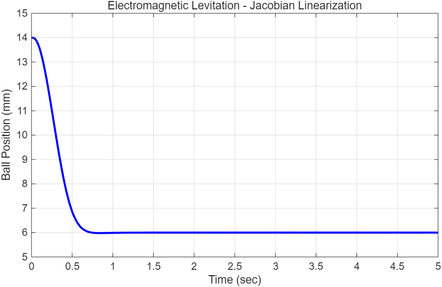
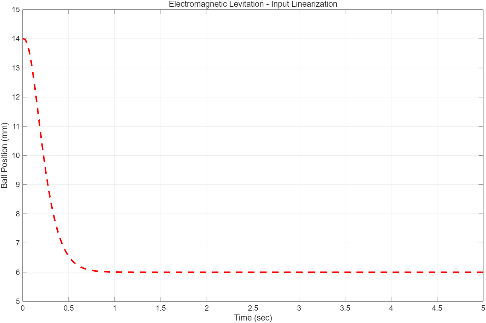
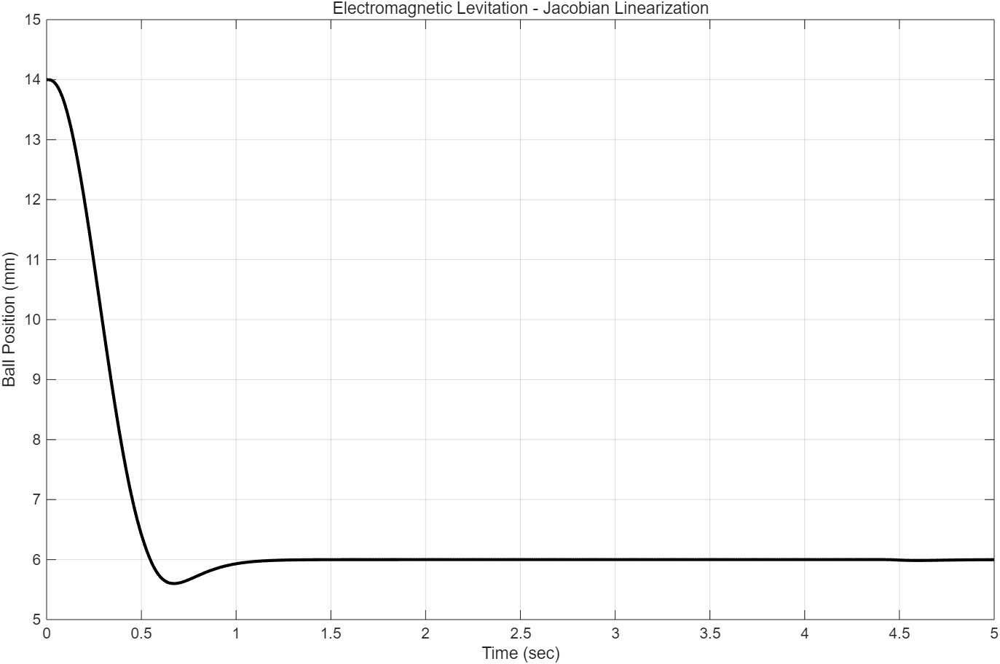

# Electromagnetic Levitation

MATLAB simulation for electromagnetic levitation control using Jacobian and Input.

## Files

- `Electromagnetic_Levitation_input.m`: Defines system parameters and simulation settings
- `Electromagnetic_Levitation_jacobian.m`: Implements Jacobian linearization control
- `Electromagnetic_Levitation_Switching_Control2.m`: Implements switching controller combining multiple methods

## Simulation Results

### 1. Jacobian Linearization Response

### 2. Input Response

### 3. Switching Controller Response

## Reference

This simulation is based on the methods presented in the following paper:

**Min-Gil Jeong, Ho-Lim Choi**,  
*Switching Control of Electromagnetic Levitation System based on Jacobian Linearization and Input-Output Feedback Linearization*,  
**The Transactions of the Korean Institute of Electrical Engineers**, Vol. 64, No. 4, pp. 578–585, 2015.  
DOI: [10.5370/KIEE.2015.64.4.578](https://doi.org/10.5370/KIEE.2015.64.4.578)

Please cite this original paper if you use or build upon this code.
